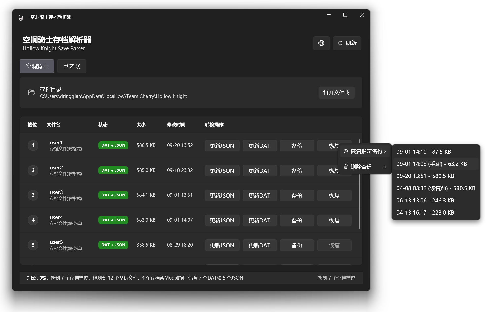

# HollowKnightSaveParser

Nexus Mods Link : 
[https://www.nexusmods.com/hollowknightsilksong/mods/319](https://www.nexusmods.com/hollowknightsilksong/mods/319)
[https://www.nexusmods.com/hollowknight/mods/113](https://www.nexusmods.com/hollowknight/mods/113)

[中文](#中文) | [English](#english)

---

## 更新日志 / Update Log

### v1.1.2 (Latest)
- 更新存档路径可以自选，预览兼容多平台存档位置。
- Allow custom save path selection and support multi-platform save locations in preview.
  
- 更新了标签系统，可以给备份的存档添加自定义标签。
- Update tag system to allow adding custom tags to backup saves.
  

### v1.1.1
- 更新了备份和恢复的右键菜单，可以管理备份文件并恢复指定版本的存档。
- Updated the backup and restore right-click menu to manage backup files and restore specific archive versions.
  

### v1.1.0
- 基础版本功能
- Base version features

---

## 中文

### 项目简介

HollowKnightSaveParser 是一个专业的空洞骑士存档文件解析和管理工具，专为游戏玩家和开发者设计。它能够读取、解析和修改空洞骑士的存档文件，支持多个游戏版本，并提供直观的可视化界面来管理游戏进度数据。

### 主要特性

- **多游戏支持**：支持空洞骑士和丝之歌（Silksong）
- **多平台兼容**：支持 Steam等平台的存档格式
- **可视化编辑**：直观的界面显示和编辑存档数据
- **批量处理**：支持多个存档文件的批量管理
- **数据安全**：自动备份原始存档文件
- **实时预览**：实时显示存档修改效果
- **现代界面**：基于 WPF 的现代化用户界面

### 支持的平台

- **Steam**：主要支持平台，自动检测 Steam 用户 ID 和存档路径
- **本地存档**：支持手动选择本地存档文件

### 支持的游戏版本

- **空洞骑士 (Hollow Knight)**：完整支持
- **丝之歌 (Hollow Knight: Silksong)**：预览支持

### 系统要求

- **操作系统**：Windows 10/11
- **运行时**：.NET 9.0 Runtime
- **内存**：至少 512MB RAM
- **存储空间**：50MB 可用空间

### 快速开始

1. **下载**：从 [Releases](../../releases) 页面下载最新版本
2. **运行**：直接运行 `HollowKnightSaveParser.exe`
3. **配置**：首次运行时会自动检测游戏安装路径
4. **使用**：选择存档文件开始解析和编辑

### 主要功能

#### 存档解析

- 读取和解析空洞骑士存档文件格式
- 显示游戏进度、物品收集、地图探索等信息
- 支持加密和未加密的存档格式

#### 数据编辑

- 修改游戏进度和统计数据
- 编辑物品和能力获取状态
- 调整游戏设置和偏好

#### 文件管理

- 自动检测存档文件位置
- 支持多个存档槽位管理
- 自动备份和恢复功能

### 使用场景

- 游戏进度备份和恢复
- 存档文件分析和调试
- 游戏数据研究和分析
- 成就和收集品管理
- 游戏测试和开发辅助

### 项目结构

- **Config/** - 配置文件和设置
- **Converters/** - 数据转换器
- **Models/** - 数据模型和实体
- **Services/** - 业务逻辑服务
- **ViewModels/** - MVVM 视图模型
- **Views/** - 用户界面视图
- **Utils/** - 工具类和辅助方法
- **Resources/** - 资源文件和图标

### 技术栈

- **框架**：WPF (.NET 9.0)
- **架构模式**：MVVM
- **UI框架**：WPF UI / Material Design
- **依赖注入**：Microsoft.Extensions.DependencyInjection
- **数据绑定**：CommunityToolkit.Mvvm
- **文件处理**：System.IO / Newtonsoft.Json

### 安全说明

- 本工具仅用于合法的个人存档管理
- 请勿用于在线游戏作弊或违反游戏服务条款
- 建议在使用前备份原始存档文件
- 使用本工具的风险由用户自行承担

### 许可证

本项目采用 MIT 许可证。详见 [LICENSE](LICENSE) 文件。

### 贡献

欢迎提交 Issue 和 Pull Request！

#### 贡献指南

1. Fork 本仓库
2. 创建特性分支 (`git checkout -b feature/AmazingFeature`)
3. 提交更改 (`git commit -m 'Add some AmazingFeature'`)
4. 推送到分支 (`git push origin feature/AmazingFeature`)
5. 打开 Pull Request

---

## English

### Project Description

HollowKnightSaveParser is a professional save file parsing and management tool for Hollow Knight, designed for gamers and developers. It can read, parse, and modify Hollow Knight save files, supports multiple game versions, and provides an intuitive visual interface for managing game progress data.

### Key Features

- **Multi-game Support**: Supports Hollow Knight and Silksong
- **Cross-platform Compatibility**: Supports save formats from Steam, GOG, and other platforms
- **Visual Editing**: Intuitive interface for displaying and editing save data
- **Batch Processing**: Support for batch management of multiple save files
- **Data Security**: Automatic backup of original save files
- **Real-time Preview**: Real-time display of save modification effects
- **Modern Interface**: Modern WPF-based user interface

### Supported Platforms

- **Steam**: Primary supported platform with automatic Steam ID detection and save path detection
- **Local Saves**: Support for manually selecting local save files

### Supported Game Versions

- **Hollow Knight**: Full support
- **Hollow Knight: Silksong**: Preview support

### System Requirements

- **Operating System**: Windows 10/11
- **Runtime**: .NET 9.0 Runtime
- **Memory**: At least 512MB RAM
- **Storage**: 50MB available space

### Quick Start

1. **Download**: Download the latest version from the [Releases](../../releases) page
2. **Run**: Run `HollowKnightSaveParser.exe` directly
3. **Configuration**: Game installation paths are automatically detected on first run
4. **Usage**: Select save files to start parsing and editing

### Main Features

#### Save Parsing

- Read and parse Hollow Knight save file formats
- Display game progress, item collection, map exploration information
- Support for encrypted and unencrypted save formats

#### Data Editing

- Modify game progress and statistics
- Edit item and ability acquisition status
- Adjust game settings and preferences

#### File Management

- Automatic detection of save file locations
- Support for multiple save slot management
- Automatic backup and restore functionality

### Use Cases

- Game progress backup and recovery
- Save file analysis and debugging
- Game data research and analysis
- Achievement and collectible management
- Game testing and development assistance

### Project Structure

- **Config/** - Configuration files and settings
- **Converters/** - Data converters
- **Models/** - Data models and entities
- **Services/** - Business logic services
- **ViewModels/** - MVVM view models
- **Views/** - User interface views
- **Utils/** - Utility classes and helper methods
- **Resources/** - Resource files and icons

### Tech Stack

- **Framework**: WPF (.NET 9.0)
- **Architecture**: MVVM
- **UI Framework**: WPF UI / Material Design
- **Dependency Injection**: Microsoft.Extensions.DependencyInjection
- **Data Binding**: CommunityToolkit.Mvvm
- **File Processing**: System.IO / Newtonsoft.Json

### Security Notice

- This tool is intended for legitimate personal save management only
- Do not use for online game cheating or violating game terms of service
- Recommend backing up original save files before use
- Users assume all risks associated with using this tool

### License

This project is licensed under the MIT License. See the [LICENSE](LICENSE) file for details.

### Contributing

Issues and Pull Requests are welcome!

#### Contributing Guidelines

1. Fork the repository
2. Create a feature branch (`git checkout -b feature/AmazingFeature`)
3. Commit your changes (`git commit -m 'Add some AmazingFeature'`)
4. Push to the branch (`git push origin feature/AmazingFeature`)
5. Open a Pull Request

### Contact & Support

If you encounter any issues or have suggestions, please feel free to create an issue in this repository.
